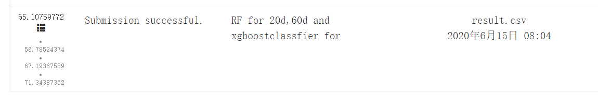

# 1. Performance of the model

According our submission records, the performance of  the model is as follows:




# 2. Environment of the code

The environment of the code is **PYTHON 3.7** and the following packages are required:

```
pandas
numpy
matplotlib
sklearn
talib
xgboost
```


# 3. Model description

The codes are composed of 4 python scripts and the main.py can directly run out of the test results, which save at the file "result.csv". 

In our codes, we train  three prediction models for three time-horizons: **1-day, 20-day, and 60-day.**

The *1-day* prediction models are XGBOOST model but with different hyper-parameters for each metals

The *20-day* and *60-day* prediction models are Random Forest models but with different features and hyper-parameters.

The major novelty of our method is making use of the predicted label, for each time-horizon, we

- First,  extract useful but not leaky features from the competition dataset;
- Second, train a Random Forest using the training data notate as $ \sum^{window\_start}_{window\_end} <features,label>$;
- Third, predict the label using the validation data on day T,  and predict the next label using the next validation data on day T+1 until day T+$V$ ; 
- Fourth,  regard the predicted labels as real labels and  retrain a Random Forest using the new training data $ \sum^{window\_start+V}_{window\_end+V} <features,label>$;
- Fifth, repeat the Third and Fourth step until the validation data on the last day.


# 4. Test time it costs

In our computer(Inter(R) Core(TM) i7-7600U CPU@2.50GHz), it costs about 3 minutes.


# 5. Contact method

Please feel free to contact us when you have some troubles reproducing the results or have question( like whether using data leak)  about the codes.

Contact Email: wwuyunjin@gmail.com

